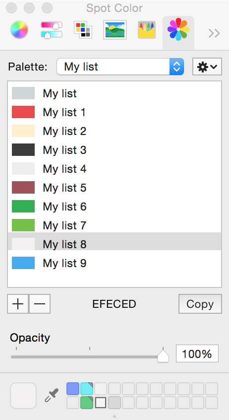

AWLColorPicker
==============

Summary
-------

Palette color picker, similar to standard one shipped with OS X, with additional functionality. Such as:

- Matches color with alpha channel.
- Matches color in 'Calibrated' and 'Device' color space.
- Has a 'Copy' button for quick copy currently selected color to clipboard.
- Has a readout wit currently selected color in the following formats:
 - Hexadecimal
- Has 'Options' panel for configuring result string in clipboard:
    - Include/Exclude "#" sign in Hexadecimal string.
    - Upper/Lowercase Hexadecimal string.
    

How to install?
--------------

**Simple way**: Download binary from [Releases](https://github.com/Svetlanik/AWLColorPicker/releases "Releases") and copy to ~/Library/ColorPickers.  
**For developers**: Checkout sources and build. Result automatically will be copied to ~/Library/ColorPickers/AWLColorPicker.colorPicker.

- - -

- - -

Release notes
-------------

15 Sep 2014: v1.0.0 - Initial

- Bug: CP-2. Color picker toolbar icon broken due compressed Assets.car
- New Feature: CP-4. Add tooltip for HEX string label.
